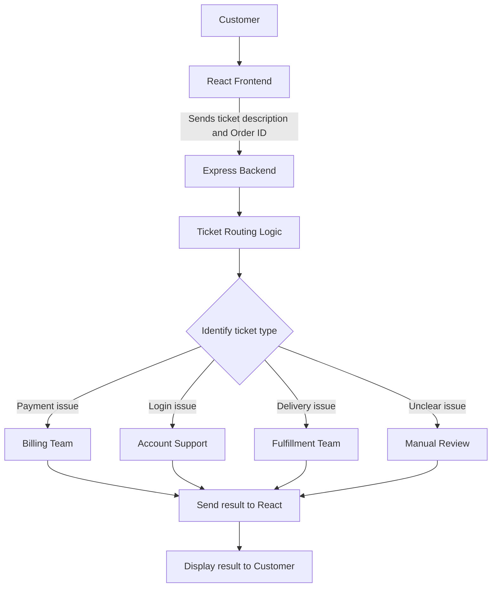

# Support Triage Desk - Architecture Diagram

```mermaid
flowchart TD
    A[Customer] --> B[React Frontend]
    B -->|Sends ticket description and Order ID| C[Express Backend]
    C --> D[Ticket Routing Logic]
    D --> E{Identify ticket type}
    E -->|Payment issue| F[Billing Team]
    E -->|Login issue| G[Account Support]
    E -->|Delivery issue| H[Fulfillment Team]
    E -->|Unclear issue| I[Manual Review]
    F --> J[Send result to React]
    G --> J
    H --> J
    I --> J
    J --> K[Display result to Customer]
```
